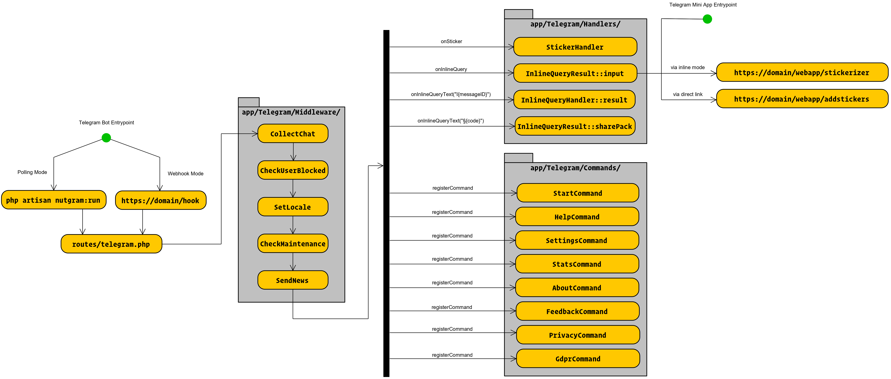

# Telegram Bot: Stickerizer

[](https://t.me/StickerizerBot)

[](https://t.me/LKS93C)
[](https://t.me/Lukasss93Support)


> This bot let's you create stickers on the fly, via [Telegram Mini App](https://core.telegram.org/bots/webapps).

## 🛠 Built with

- Backend
  - Programming language: PHP 8.2
  - Language framework: [Laravel](https://github.com/laravel/laravel)
  - Bot framework: [Nutgram](https://github.com/nutgram/nutgram)
- Frontend
  - Programming language: JavaScript, TypeScript
  - Language framework: Vue 3
  - Style tools: SCSS, TailwindCSS

## 🗃️ Flow chart


## 🚀 Setup guide

<details>
    <summary>On a Development environment</summary>

### 🛡 Requirements
- Docker
- Docker Compose
- GIT
- ngrok
- Telegram Bot Token

### 📦 Installation
1. Clone this repository
    ```bash
    git clone https://github.com/lukasss93/telegram-stickerizer.git
    ```
2. Enter in the project folder
    ```bash
    cd telegram-stickerizer
    ``` 
3. Run the docker containers
    ```bash
    docker-compose up -d
    ```
4. Enter in the container console
    ```bash
    docker exec -it telegram-stickerizer-app bash
    ```
5. Install dependencies
    ```bash
    composer install
    npm install
    ```
6. Init .env file
    ```bash
    composer run init-env
    ```
7. Edit the .env file
    - Set the `TELEGRAM_TOKEN` variable with your `bot token`
    - Set the `APP_URL` variable with your `ngrok url`
    - Set the `DB_HOST` variable with `db`
    - Set the `DB_DATABASE` variable with `botdb`
    - Set the `DB_USERNAME` variable with `botdb`
    - Set the `DB_PASSWORD` variable with `botdb`
8. Build frontend
    ```bash
    npm run build
    ```
9. Fix laravel permissions
    ```bash
    chmod -R 775 bootstrap/ storage/
    chown -R www-data:www-data bootstrap/ storage/
    ```
10. Initialize the database
    ```bash
    php artisan migrate:fresh
    php artisan db:seed --class="Database\Seeders\PacksSeeder"
    ```
11. Register bot commands
    ```bash
    php artisan nutgram:register-commands
    ```
12. Run ngrok (only for testing mini app)<br>
    Remember to set your ngrok token as specified [here](https://dashboard.ngrok.com/get-started/setup)<br>
    ⚠**️ You need to launch this command outside the container!**
    ```bash
    ngrok http 80 --hostname=yourdomain
    ```
13. Start the bot
    ```bash
    php artisan nutgram:run
    ```
</details>

<details>
    <summary>On a Production environment</summary>

### 🛡 Requirements
- Apache / nginx
- SSL support
- PHP ≥ 8.2 (with GD extension)
- MariaDB ≥ 10.2.3 or Postgresql ≥ 9.5
- NodeJS ≥ 16.0
- Crontab (to update cached statistics)
- GIT
- Telegram Bot Token

### 📦 Installation
- `cd <vhost-folder>`
- `git clone https://github.com/lukasss93/telegram-stickerizer.git .`
- `wget https://getcomposer.org/download/latest-2.x/composer.phar`
- `php composer.phar i`
- `npm i`
- `php composer.phar run init-env`
- Edit the `.env` file with your preferences
- `npm run build`
- `php artisan migrate --force --step`
- `php artisan db:seed --class="Database\Seeders\PacksSeeder" --force`
- `sudo chmod -R 775 bootstrap/ storage/`
- `sudo chown -R www-data:www-data bootstrap/ storage/`
- `php artisan optimize`
- Create a new cron: `* * * * * cd /path-to-your-project && php artisan schedule:run >> /dev/null 2>&1`
- `php artisan nutgram:register-commands`
- `php artisan nutgram:hook:set https://<domain>/hook`

</details>

## 🎢 Usage


## 🌠 Continuous deployment
This project will be updated in production at **every pushed tag** to master branch.<br>
Check this github workflow: [deploy.yml](.github/workflows/deploy.yml)

## 📃 Changelog
Please see the [changelog.md](changelog.md) for more information on what has changed recently.

## 🏅 Credits
- [Luca Patera](https://github.com/Lukasss93)
- [All Contributors](https://github.com/Lukasss93/telegram-stickerizer/contributors)

## 📖 License
Please see the [LICENSE.md](LICENSE.md) file for more information.

## 🤖 My Telegram bots
- Stickerizer | [@StickerizerBot](https://t.me/StickerizerBot) | [Source](https://github.com/Lukasss93/telegram-stickerizer)
- Sticker Optimizer | [@NewStickerOptimizerBot](https://t.me/NewStickerOptimizerBot) | [Source](https://github.com/Lukasss93/telegram-stickeroptimizer)
- Mermaid Generator | [@newmermaidbot](https://t.me/newmermaidbot) | [Source](https://github.com/Lukasss93/telegram-mermaid/)
- File Converter | [@newfileconverterbot](https://t.me/newfileconverterbot)
- Chat Merger | [@ChatMergerBot](https://t.me/ChatMergerBot)

## 🔗 Other links
- [News Channel](https://t.me/LKS93C)
- [Support Group](https://t.me/Lukasss93Support)
